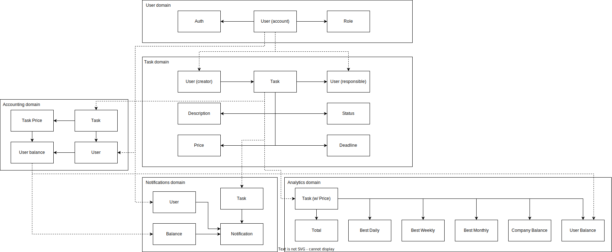

# Разбор требований

## Actor, Command, Data, Event...

| Требование                     | Actor                                  | Command                                       | Data                                                                | Event                   |
|--------------------------------|----------------------------------------|-----------------------------------------------|---------------------------------------------------------------------|-------------------------|
| Вход в систему                 | User or "User.Auth" query              | Auth                                          | User + Role                                                         | User.Authenticated      |
| Показ дашборда                 | User                                   | Show a dashboard                              | User + Task + Notification                                          | -                       |
| Создание задачи                | User                                   | Create a task                                 | User + Task                                                         | Task.Assigned           |
| Ассайн задач                   | User (Admin or Manager)                | Assign task                                   | User + Role + Task                                                  | Task.Assigned           |
| Получение задач                | User                                   | Show tasks list                               | User + Role + Task + TaskStatus                                     | -                       |
| Выполнение задачи              | User (Responsible)                     | Set task as completed                         | Task + TaskStatus                                                   | Task.Completed          |
| Пополнение баланса             | "Task.Completed" event                 | Replenish user's balance                      | Task + User Balance                                                 | UserBalance.Replenished |
| Уведомление о пополнении       | "UserBalance.Replenished" event        | Notify user about balance                     | User + User Balance + Notification                                  | Notification.Created    |
| Уведомление об ассайне         | "Task.Assigned" event                  | Notify user about assigned task               | User + Task + Notification                                          | Notification.Created    |
| Отправка уведомления           | "Notification.Created" event           | Send notification                             | User (Email?) + Notification                                        | Notification.Sended     |     
| Синхронизация данных аналитики | "UserBalance.Replenished" event        | Sync data with analytics                      | Task + User Balance                                                 | Analytics.Synced        |
| Запись в аудит-лог             | "UserBalance.Replenished" event        | Add information about balance to audit-log    | User + User Balance                                                 | AuditLog.Updated        |
| Пересчет аналитических данных  | "Task.Completed" event                 | Recalculate analytic data                     | Task + Task Price + Company Balance + "Most Valued Task for Period" | Analytics.Recalculated  |
| Показ самой дорогой задачи     | User (management, accounting or admin) | Show most values analytic data                | "Most Valued Task for Period"                                       | -                       |
| Показ баланса топ-менеджемента | User (admin, management)               | Show how much earned money for top-management | Company Balance                                                     | -                       |

## Доменная модель

Доменная модель приложена в файле DomainModel.svg

## Сервисы

- Users Service – сервис отвечает за авторизацию пользователей
- Tasks Service – cервис для работы с задачами
- Notification Service – сервис для создания и рассылки уведомлений
- Accounting Service - сервис для бухгалтерии (начисление денег попугам)
- Analytics Service - сервис для аналитики

## События и запросы

### Синхронные

#### Авторизация Пользователя (User.Auth)

Запрос к Users Service

| Поле       | Тип    |
|------------|--------|
| User Token | String |
| Action     | String |

Возвращает событие `User.Authorized`

| Поле      | Тип     |
|-----------|---------|
| Permitted | Boolean |

### Асинхронные

#### Ассайн задачи (Task.Assigned)

| Поле    | Тип    |
|---------|--------|
| User ID | String |
| Task ID | String |

Продюсер: Task Service
Консьюмер: Notification Service

#### Завершение задачи (Task.Completed)

| Поле       | Тип     |
|------------|---------|
| Task ID    | String  |
| User ID    | String  |
| Task Price | Decimal |

Продюсер: Task Service
Консьюмер: Accounting Service и Analytics Service

#### Пополнение баланса (UserBalance.Replenished)

| Поле    | Тип     |
|---------|---------|
| User ID | String  |
| Amount  | Decimal |

Продюсер: Accounting Service
Консьюмер: Analytics Service и Notifications Service

#### Создание нотификации (Notification.Created)

Скорее внутреннее событие для сервиса, которое поставит нотификацию в очередь рассылки, по типу добавления в очередь Sidekiq.

| Поле                   | Тип      |
|------------------------|----------|
| User ID                | String   |
| Notification Content   | String   |

Продюсер: Notification Service
Консьюмер: Notification Service (?)

#### Служебные события

`Notification.Sended`, `Analytics.Recalculated` и `Analytics.Synced` могут использоваться отдельными служебными сервисами (например, сервис логирования, который получает данные этих событий)
